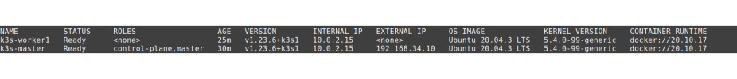

# Pruebas de rendimiento para ambientes basados en Kubernetes

El objetivo de este repositorio es proveer los entornos virtuales que permitan llevar a cabo la comparación de pruebas de rendimiento sobre diferentes tecnologías basadas en Kubernetes. 
Las tecnologías a evaluar son:

* [k3s](https://k3s.io/)

* [kubernetes](https://kubernetes.io/)

* [microk8s](https://microk8s.io/)

El entorno de evaluación estará constituido por tres máquinas virtuales, una de ellas hará las veces de nodo maestro y las otras dos de nodos de trabajo como lo establece la arquitectura de Kubernetes.

Las máquinas tendrán todas las mismas características sin importar que una herramienta o la otra tengan diferentes requerimientos en el perfil del hardware. 
Es decir, que aunque algunas herramientas requieran menos hardware, las herramientas correrán todos con los mismos requerimientos de hardware, en particular número de cores y tamaño en RAM.

<table>
  <tr>
    <th rowspan="2"> Tecnología </th>
    <th colspan="2"> Master </th>
    <th colspan="2"> Worker </th>
    <th rowspan="2"> Enlace </th>
  </tr>
  <tr>
    <th> CPU </th>
    <th> RAM </th>
    <th> CPU </th>
    <th> RAM </th>
  </tr>
  <tr> <!-- k3s -->
    <td align=center> 
      k3s
    </td>
    <td> <!-- CPU master -->
      Intel Xeon, 3.00 GHz
    </td>
    <td> <!-- RAM master -->
      896 MB
    </td>
    <td> <!-- CPU worker -->
      Intel Xeon, 3.00 GHz
    </td>
    <td> <!-- RAM worker -->
      256 MB
    </td>
    <td>
      <a href="https://rancher.com/docs/k3s/latest/en/installation/installation-requirements/resource-profiling/"> rancher.com </a>
    </td>
  </tr>
  <tr> <!-- kuberentes -->
    <td align=center> 
      kubernetes
    </td>
    <td> <!-- CPU master -->
      2 cores
    </td>
    <td> <!-- RAM master -->
      2 GB
    </td>
    <td> <!-- CPU worker -->
      2 cores
    </td>
    <td> <!-- RAM worker -->
      2 GB
    </td>
    <td>
      <a href="https://kubernetes.io/docs/setup/production-environment/tools/kubeadm/install-kubeadm/"> kubernetes.io </a>
    </td>
  </tr>
  <tr> <!-- microk8s -->
    <td align=center> 
      microk8s
    </td>
    <td> <!-- CPU master -->
      ---
    </td>
    <td> <!-- RAM master -->
      540 MB - 4 GB
    </td>
    <td> <!-- CPU worker -->
      ---
    </td>
    <td> <!-- RAM worker -->
      540 MB - 4 GB
    </td>
    <td>
      <a href="https://microk8s.io/docs/getting-started"> microk8s.io </a>
    </td>
  </tr>

</table>

## Instalación de K3S

Para ejecutar K3S en este repositorio ejecutar los siguientes comandos:

* `vagrant up`

* Una vez las máquinas estén en operación se procede a instalar el nodo `master`.
  
  * `vagrant ssh k3s-master`
  * `sudo -i`
  * `cd /vagrant`
  * `./scripts/install_k3s_master.sh`
  * `exit # para salir del comando 'sudo -i'`
  * `exit # para salir de la máquina virtual`

* Se procede a instalar el `k3s-worker1`:

  * `vagrant ssh k3s-worker1`
  * `sudo -i`
  * `cd /vagrant`
  * `./scripts/install_k3s_worker.sh`
  * `exit # para salir del comando 'sudo -i'`
  * `exit # para salir de la máquina virtual`

* Se procede a instalar el `k3s-worker1`:

  * `vagrant ssh k3s-worker1`
  * `sudo -i`
  * `cd /vagrant`
  * `./scripts/install_k3s_worker.sh`
  * `exit # para salir del comando 'sudo -i'`
  * `exit # para salir de la máquina virtual`

* Para validar que el ambiente de Kubernetes está operando:

  * `vagrant ssh k3s-master`
  * `sudo -i`
  * `kubectl get nodes -o wide`
  * `exit # para salir del comando 'sudo -i'`
  * `exit # para salir de la máquina virtual`

